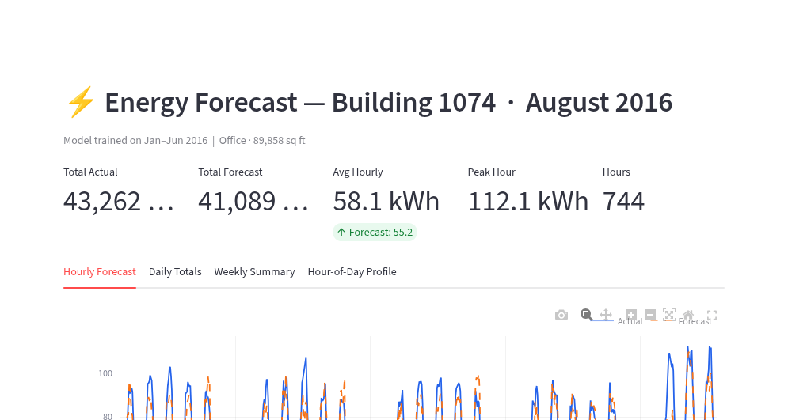

# ⚡ ASHRAE Energy Forecaster



[](https://ashrae-energy-forecasting.streamlit.app/)

An end-to-end machine learning and operational analytics pipeline to forecast hourly commercial building electricity consumption. Built on the **ASHRAE – Great Energy Predictor III** dataset, this repository covers data extraction, time-series feature engineering, gradient-boosted tree modeling (XGBoost), and an interactive Streamlit dashboard containerized for Docker.

🌐 **Live Application**: [https://ashrae-energy-forecasting.streamlit.app/](https://ashrae-energy-forecasting.streamlit.app/)

---

## 📌 Project Overview

Electricity consumption in commercial buildings is driven by business operating hours, HVAC schedules, and weekly occupancy cycles. Accurately forecasting this demand helps facility managers plan peak-load mitigation, optimize heating and cooling schedules, and reduce utility demand charges.

This project implements an end-to-end time-series forecasting pipeline using real-world smart meter data from the **ASHRAE – Great Energy Predictor III** benchmark dataset:

- **The Facility**: Focuses on **Building 1074**, an **89,858 sq ft commercial office space** screened for complete, uninterrupted hourly electricity observations.
- **Feature Engineering**: Models diurnal and weekly operational patterns using calendar features (`hour`, `day of week`, `month`) and multi-scale autoregressive lag features (`24-hour lag` for prior-day load, `168-hour lag` for same-day prior-week load) without forward lookahead bias.
- **Predictive Modeling**: An **XGBoost** regression model trained strictly on historical data from the first six months (January 1 – June 30, 2016), evaluating out-of-sample forward consumption across **August 2016** (744 hours).
- **Interactive Monitoring**: A companion Streamlit dashboard (hosted live on Streamlit Cloud) providing visual inspection of hourly forecasts, daily error diagnostics, weekly peak demand, and diurnal weekday vs. weekend load envelopes.

---

## 🗂️ Repository Structure

```text
ashrae-energy-forecasting/
├── apps/
│   ├── streamlit/app.py                  # Streamlit forecasting dashboard
│   └── flask/app.py                      # Flask service prototype
├── data/
│   ├── building/1074/building_1074.csv   # Building 1074 hourly data (309 KB)
│   ├── building_metadata(in).csv         # Building metadata (sq ft, site ID, primary use)
│   ├── weather_train.csv                 # Hourly site weather observations
│   └── train.csv                         # Raw ASHRAE training observations (optional / local)
├── models/
│   └── building_1074_six_months_model.pkl# Trained XGBoost model for Building 1074
├── notebooks/
│   ├── building_selection_tool.ipynb     # Screening candidate buildings for data completeness
│   ├── building_data_extraction.ipynb    # Slicing individual buildings from train.csv
│   ├── task1.ipynb                       # Building 105 EDA, lag features, and baseline comparison
│   └── six_months.ipynb                  # Building 1074 6-month training & August forecast analysis
├── Dockerfile                            # Production container spec (Cloud Run ready)
├── .dockerignore                         # Optimized exclusion rules for slim container builds
├── requirements.txt                      # Project dependencies
└── README.md
```

---

## ⚡ Clone & Setup

To clone and set up the repository locally:

```bash
git clone https://github.com/AryanBhanot/ashrae-energy-forecasting.git
cd ashrae-energy-forecasting

# Create and activate virtual environment
python -m venv .venv
# Windows:
.\.venv\Scripts\activate
# Linux/macOS:
source .venv/bin/activate

# Install dependencies
pip install -r requirements.txt
```

---

## 🚀 Running Applications

### Streamlit Dashboard

- **Live Hosted App**: [https://ashrae-energy-forecasting.streamlit.app/](https://ashrae-energy-forecasting.streamlit.app/)
- **Run Locally**:
```bash
streamlit run apps/streamlit/app.py
```
Open `http://localhost:8501` in your browser.

### Flask Service (Optional)
```bash
flask --app apps/flask/app run --port 5000
```
Open `http://localhost:5000/` or `http://localhost:5000/hello/YourName`.

---

## 🐳 Docker Containerization

The container image is built on `python:3.13-slim`. The `.dockerignore` file excludes large raw datasets (`train.csv` at ~647 MB) while bundling `building_1074.csv` and `models/`, ensuring fast image builds and minimal footprint.

### Run Locally with Docker
```bash
docker build -t ashrae-energy-forecasting .
docker run -p 8080:8080 -e PORT=8080 ashrae-energy-forecasting
```
Access the application at `http://localhost:8080`.

---

## ⚖️ License & Acknowledgements

- **Dataset**: Provided by ASHRAE and Kaggle under the [Great Energy Predictor III](https://www.kaggle.com/c/ashrae-energy-prediction) competition.
- **Author**: Aryan Bhanot
